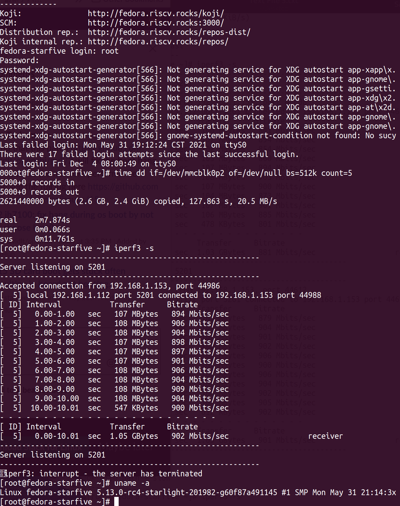
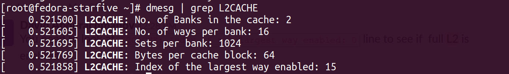

## BeagleV Starlight RISC-V Fedora image
This is a respin of Fedora 33 to support the [StarFive JH7100 SoC](https://github.com/starfive-tech/beaglev_doc/blob/main/JH7100%20Data%20Sheet%20V01.01.04-EN%20(4-21-2021).pdf) (RV64GC) and [BeagleV Starlight board](https://github.com/beagleboard/beaglev-starlight).  Find more details in the [BeagleV Starlight getting started guide](https://wiki.seeedstudio.com/BeagleV-Getting-Started/).  Please open issues regarding the Fedora image in [this repository](https://github.com/starfive-tech/beaglev_fedora/issues).

### Download the latest image: 
* **2021-May-16:** [Fedora-riscv64-vic7100-xfce-dev-Rawhide-20210516233526.n.0-sda.raw.zst](https://files.beagle.cc/file/beagleboard-public-2021/images/Fedora-riscv64-vic7100-xfce-dev-Rawhide-20210516233526.n.0-sda.raw.zst)
  * [sha256sum](https://files.beagle.cc/file/beagleboard-public-2021/images/Fedora-riscv64-vic7100-xfce-dev-Rawhide-20210516233526.n.0-sda.raw.zst.sha256sum): `ab916cf46efc57c034aba8f79018a3af70a67d121126cbec271cdc12cdf64f05`
  * Note: [supports XFCE desktop on HDMI](https://github.com/starfive-tech/Fedora_on_StarFive/issues/22#issuecomment-841719888)


### Past images:
* **2021-April-19:** [Fedora-riscv64-vic7100-dev-raw-image-Rawhide-20210419121453.n.0-sda.raw.zst](https://files.beagle.cc/file/beagleboard-public-2021/images/Fedora-riscv64-vic7100-dev-raw-image-Rawhide-20210419121453.n.0-sda.raw.zst)
  * sha256sum: `e3d0df18d2eeb913aafabbb975c7a8803fdae333643a946b20607060e18df0db`


### Custome Fedora image
  * Fedora 2021-May-16 which boots starlight branch which is 5.13-rc4 latest optmization
    1. Adds skb-recycle patches to improve network performance from @teknoraver. https://github.com/teknoraver/linux/tree/starfive
    2. Adds improving sdcard performance. https://github.com/starfive-tech/Fedora_on_StarFive/issues/23
    3. Adds optimization of unaligned access. https://github.com/mcd500/linux-jh7100/tree/starlight-sdimproved-misaligh
* Download
    * [Fedora-riscv64-vic7100-xfce-dev-Rawhide-20210516233526.n.0-sda-akira-5.13.rc4.raw.zst](https://drive.google.com/file/d/1Y9kXMkXHe5y-W-OwZmaZPibCLUlsSRoX/view?usp=sharing)
    * sha256sum: `75dbcca7f480922af74e4b1c0fd33ee3f9af64130d8a88245532f67f741245b5`
* 
*  
* Instruction of writing it with dd
```sh
  $ zstd -d Fedora-riscv64-vic7100-xfce-dev-Rawhide-20210516233526.n.0-sda*.zst
  $ sudo dd if=Fedora-riscv64-vic7100-xfce-dev-Rawhide-20210516233526.n.0-sda*.raw of=/dev/location_of_sd bs=4M conv=fsync
  Wait until console prompt returns. Takes several minutes. It may good to whach dd to finish with `sudo iotop`.
```

### Custom u-boot binary image
*
    1. Enables the full 2MB L2 cache from @davidlt https://github.com/davidlt/u-boot/commits/Fedora https://github.com/davidlt/opensbi/tree/Fedora
    2. Includes dtb from latest @esmil kernel
* Download
    * [fw_payload.bin.out](https://drive.google.com/file/d/1LsBOV58Q2VKkaFgLtlPITwtdDNCytGrM/view?usp=sharing)
    * sha256sum `27e23eb3a03c94b883458aa98dd342f1646de4f80edf628046f4200b65bb66e5`
* [Instruction of writing u-boot](
https://wiki.seeedstudio.com/BeagleV-Make-File-System-Compile-uboot-Kernal/#flash-uboot)
* 
